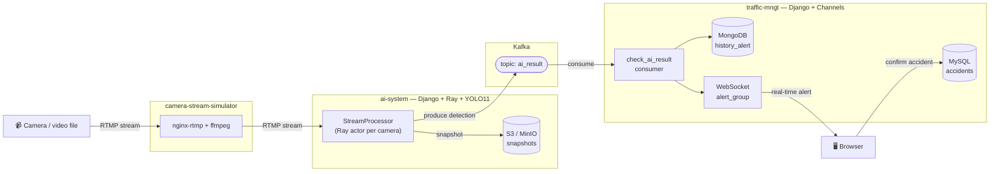

# Surveillance-Camera-System

> Real-time traffic surveillance system that integrates a **YOLO11** model to **detect traffic accidents** from camera streams and alert the monitoring authority.

This is the **system** part of the graduation project *"Research on Object Detection and development of a traffic surveillance system integrating a YOLO model to detect traffic accidents in Vietnam"* (University of Transport and Communications – Ho Chi Minh City Campus, 2025).

- 📄 Report: [My-Achievements / Reports / 4th-year / DATN.pdf](https://github.com/K1ethoang/My-Achievements/blob/main/Reports/4th-year/DATN.pdf)
- 🧠 Model training & evaluation: [Accident_Detect](https://github.com/K1ethoang/Accident_Detect)

---

## Architecture overview



| Component | Role | Tech |
|---|---|---|
| **camera-stream-simulator** | Simulates IP cameras by publishing RTMP streams from video files | `tiangolo/nginx-rtmp` (Docker), `ffmpeg` |
| **ai-system** | Manages the camera list; each active camera runs as a **Ray actor** that reads its RTMP stream and runs YOLO11 + OpenCV; when an accident is detected it captures a snapshot to S3/MinIO and **produces** the result to the Kafka topic `ai_result` | Django 5.2, DRF, Ray, Ultralytics YOLO11, OpenCV, `confluent-kafka`, `django-storages` (S3) |
| **traffic-mngt** | **Consumes** the `ai_result` topic, stores it in MongoDB (one collection per day, `yyyymmdd`), pushes it to the UI in real time over WebSocket; manages (CRUD) confirmed accident records in MySQL, exports to Excel | Django 5.2, Channels + Redis, `confluent-kafka`, `pymongo` (MongoDB), MySQL |

### Data flow

1. `nginx-rtmp` receives video from a real camera or from `ffmpeg` (simulation) at `rtmp://<host>:1935/live/<key>`.
2. `ai-system` – the `handle_stream_camera` command initializes Ray and, for every `CameraStream` with `is_active=True`, spawns a `StreamProcessor` actor that reads the stream, runs YOLO11 with a confidence threshold, and detects `accident` (plus objects intersecting the accident region).
3. On an accident: the snapshot is stored in the S3/MinIO bucket and a JSON message (`camera_url`, `camera_serial`, `snapshot_key`, `detections`, `detect_at`) is produced to the `ai_result` topic.
4. `traffic-mngt` – the `check_ai_result` command consumes the topic, writes to MongoDB, and `group_send`s to the WebSocket group `alert_group`.
5. The browser opens the *Alert history* page and receives real-time updates; the operator can confirm and save an official accident record (MySQL) and export the list to Excel by date range.

## Requirements

- Python **3.13** (see `.python-version`)
- Docker (to run `nginx-rtmp`) and `ffmpeg`
- Infrastructure services: **Apache Kafka** (topic `ai_result`), **MySQL**, **MongoDB**, **Redis**, and **MinIO** or S3
- YOLO11 weights – `ai-system/weights/yolo11_n.pt`, `yolo11_x.pt` are provided (Git LFS)

> In the project, the whole infrastructure (Kafka, MySQL, MongoDB, RTMP server) was deployed on Google Compute Engine.

## Setup & run

### 0. camera-stream-simulator (camera simulation)

```bash
cd camera-stream-simulator
docker compose up -d              # nginx-rtmp listens on port 1935
./start_cameras.sh                # ffmpeg loops videos/0420.mp4 -> rtmp://localhost/live/cam1
./stop_cameras.sh                 # stop the ffmpeg processes
```

### 1. ai-system

```bash
cd ai-system
python -m venv .venv && source .venv/bin/activate
pip install -r requirements.txt
cp .env.sample .env               # fill in SECRET_KEY, MySQL DB, KAFKA_*, MODEL_PATH_YOLO_11, AWS_* (MinIO/S3)
python manage.py migrate
python manage.py createsuperuser

python manage.py runserver 8000            # terminal 1 – web + API + Django admin
python manage.py handle_stream_camera      # terminal 2 – Ray + camera stream processing
```

| Path | Description |
|---|---|
| `/` | Camera stream list (add / edit / toggle) |
| `/camera/create/`, `/camera/<uuid>/edit/` | Camera form |
| `/mock_detect/` | Send a **mock** accident detection payload to Kafka for testing |
| `/api/camera_stream/` | REST API (CRUD + `POST /api/camera_stream/<id>/toggle/`) |
| `/admin/` | Django admin |

The Ray dashboard is at `http://127.0.0.1:8265` by default (job `handle_stream_camera`).

### 2. traffic-mngt

```bash
cd traffic-mngt
python -m venv .venv && source .venv/bin/activate
pip install -r requirements.txt
cp .env.sample .env               # also add the MongoDB variables (see table below)
python manage.py migrate
python manage.py createsuperuser

python manage.py runserver 8001            # terminal 1 – web (Daphne/ASGI, WebSocket)
python manage.py check_ai_result           # terminal 2 – Kafka consumer -> MongoDB + WebSocket
```

Environment variables for `traffic-mngt/.env` (in addition to `.env.sample`):

```env
DB_MONGO_HOST=127.0.0.1
DB_MONGO_PORT=27017
DB_MONGO_USER=admin
DB_MONGO_PASSWORD=...
DB_MONGO_DB=history_alert
```

| Path | Description |
|---|---|
| `/` | Home |
| `/history-alert/` | Accident alert history from the AI system (real time, MongoDB data) |
| `/accident/` | Confirmed accident records (MySQL) – add / edit / delete |
| `/accident/export/` | Export to Excel by date range |
| `ws://<host>/ws/alerts/` | WebSocket channel that receives alerts |

## Directory layout

```
Surveillance-Camera-System/
├── camera-stream-simulator/     # nginx-rtmp + ffmpeg scripts to simulate cameras
│   ├── docker-compose.yml
│   ├── start_cameras.sh / stop_cameras.sh
│   └── videos/
├── ai-system/                   # Django + Ray + YOLO11 (producer)
│   ├── ai_app/                  # CameraStream model, views/API, signals, utils (Kafka + S3)
│   ├── camera_process/          # StreamProcessor (Ray actor), registry, utils
│   ├── ai_app/management/commands/handle_stream_camera.py
│   └── weights/                 # yolo11_n.pt, yolo11_x.pt
└── traffic-mngt/                # Django + Channels (consumer)
    ├── main_app/                # Accident/User models, views, MongoService, consumers (WebSocket)
    ├── main_app/management/commands/check_ai_result.py
    └── templates/
```

## Security note

`ai-system/ai_system/storage.py` and the `.env.sample` files contain **default values** (SECRET_KEY, S3 keys, DB passwords) meant for development only. Override all of them via `.env` and do **not** commit a real `.env`.

## License

For educational and research purposes only.
